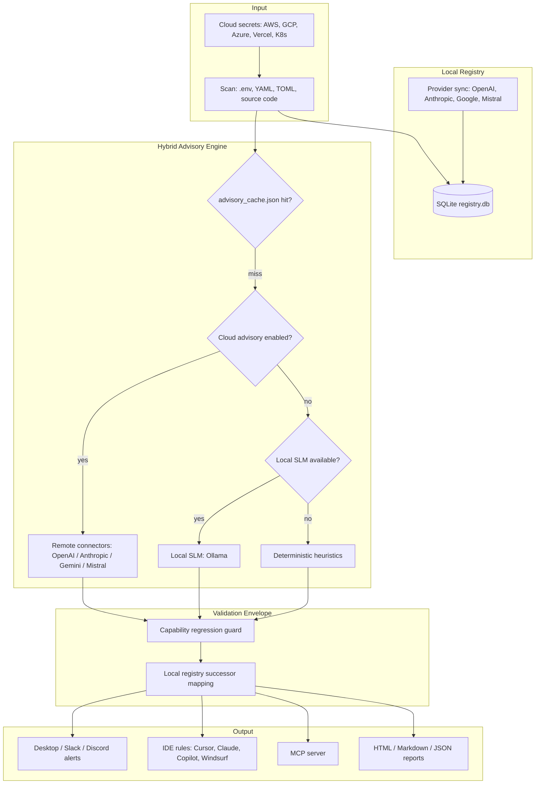

# Chowkidar

*Chowkidar* (चौकीदार) means **watch guard** in Hindi — a local sentinel that keeps watch over the LLM models in your codebase so deprecated models never take production down.

[](https://pypi.org/project/chowkidar/0.9.5/)
[](https://github.com/bhav09/chowkidar/releases/latest)
[](https://pepy.tech/projects/chowkidar)
[](https://opensource.org/licenses/MIT)

**Chowkidar** is a secure, local-first LLM model deprecation watchdog. It scans your codebase and configuration files for LLM model references, cross-references them with a locally cached deprecation database, and alerts you before models sunset.

By default everything runs on your machine with zero data exfiltration. Remote cloud advisory classification is strictly **opt-in** for CI/CD environments where a local SLM is unavailable.

## Architecture



**Flow in plain terms:** Chowkidar scans your project (and optionally cloud secret stores), syncs provider deprecation data into a local database, classifies each model's usage purpose through a three-tier engine (remote API → local SLM → heuristics), then applies deterministic successor selection and capability validation before alerting you or updating IDE rules.

## Why Chowkidar?

In the rapidly evolving landscape of Large Language Models, providers (OpenAI, Anthropic, Google, Mistral) deprecate and sunset models at an unprecedented pace. When a model sunsets, your application's API calls fail — leading to **immediate production outages, broken user experiences, and lost revenue**.

Chowkidar acts as your automated, local-first sentinel to eliminate this risk.

### What It Does For You

- **Continuous Codebase & Cloud Auditing**: Scans repositories, environment variables, GitHub Secrets, and cloud provider secret stores (AWS, GCP, Azure, Vercel, Kubernetes) for active LLM model references.
- **Proactive Multi-Channel Alerting**: Warns you via desktop notifications, Slack Block Kit, or Discord webhooks at critical thresholds (30, 15, 7, and 1 day) before a model sunsets.
- **Hybrid Purpose Classification**: Three-tier advisory engine — opt-in remote cloud connectors, local Ollama SLM, or offline heuristics — classifies how you use each model (coding, reasoning, embeddings, chat).
- **Deterministic Successor Selection**: Remote LLMs classify purpose only; successor models and capability validation always come from Chowkidar's local registry and capability regression guard.
- **Automated, Safe Migrations**: Previews and applies atomic updates to configuration files with automatic backups and rollback support.
- **AI Editor Alignment**: Generates passive workspace rules and runs an active MCP server so AI coding assistants (Cursor, Claude Code, Copilot, Windsurf) never write deprecated models.

### The Value You Get

- **Zero Production Outages**: Migrate well in advance of provider deadlines.
- **Privacy by Default**: Runs locally and offline. Opt-in cloud advisory sends only minimized, redacted code snippets — never full files or secrets.
- **No Capability Regressions**: Compares context size, output tokens, vision, and tool-use support before recommending successors.
- **Immediate FinOps Savings**: Built-in cost-impact engine shows input/output token price deltas in percentage terms before you migrate.
- **Zero-Config Developer Experience**: `chowkidar setup` auto-configures your workspace, IDE rules, and background daemon in seconds.

## Quick Start

```bash
# Install
pip install chowkidar

# Interactive project setup (config, DB, provider sync, initial scan, IDE rules)
chowkidar setup

# One-command demo: sync → scan → HTML report → open in browser
chowkidar showcase
```

## Setup & Configuration Guide

### For Human Developers

#### Local Installation & Project Initialization

```bash
pip install chowkidar
chowkidar setup
```

`chowkidar setup` creates `.chowkidar/` (config + SQLite DB), syncs deprecation data, scans your project, and writes IDE rules.

#### Continuous Background Monitoring

```bash
chowkidar daemon
```

The daemon monitors watched projects and triggers alerts at 30, 15, 7, and 1 day before expiry.

#### Cloud Advisory (Opt-In, for CI/CD)

When Ollama is unavailable (e.g. GitHub Actions), enable remote purpose classification:

```toml
# .chowkidar/config.toml
cloud_advisory_enabled = true
cloud_advisory_provider = "openai"   # openai | anthropic | google | mistral
cloud_advisory_model = "gpt-4o-mini"
```

```bash
export CHOWKIDAR_OPENAI_API_KEY="sk-..."
```

Remote connectors batch-classify purposes with strict timeouts, secret redaction, and automatic fallback to local heuristics. They never select successor models.

#### Cloud & CI/CD Deployment

**GitHub Actions:**

```yaml
name: Chowkidar Watchdog
on:
  push:
    branches: [main]
  schedule:
    - cron: '0 9 * * 1'
jobs:
  scan:
    runs-on: ubuntu-latest
    steps:
      - uses: actions/checkout@v4
      - name: Run Chowkidar
        uses: bhav09/chowkidar@v0.9.5
        with:
          gate: true
          slack_webhook: ${{ secrets.SLACK_WEBHOOK }}
```

**Docker:**

```bash
docker run -d \
  -v $(pwd)/.chowkidar:/app/.chowkidar \
  -e CHOWKIDAR_SLACK_WEBHOOK="https://hooks.slack.com/services/..." \
  bhavishya/chowkidar:latest
```

### For AI Agents & IDEs

**Passive (workspace rules):** `chowkidar setup` or `chowkidar rules write` generates rules for Cursor, Claude Code, Copilot, and Windsurf.

**Active (MCP):** Add to your IDE's MCP config:

```json
{
  "mcpServers": {
    "chowkidar": {
      "command": "chowkidar",
      "args": ["mcp"]
    }
  }
}
```

## Top 5 CLI Commands

### 1. `chowkidar showcase`
One-command demo run: syncs provider data, scans your project, generates an interactive HTML report, and opens it in your browser. Best way to see Chowkidar in action.

### 2. `chowkidar setup`
Project-scoped configuration, database initialization, provider sync, initial scan, and IDE rules generation.

### 3. `chowkidar scan`
Locates all LLM model references in your code and configuration files.

### 4. `chowkidar check`
Cross-references detected model strings against the deprecation registry and prints inline warnings.

### 5. `chowkidar report`
Generates comprehensive Markdown, JSON, or interactive HTML deprecation reports.

See [COMMANDS.md](COMMANDS.md) for the complete command reference.

## Security & Local Safety

- **Privacy First**: No code, secrets, or project paths leave your machine unless you explicitly enable `cloud_advisory_enabled`. When enabled, only minimized, redacted context snippets are sent.
- **Safe Writes**: File modifications require `auto_update = true`. Every update uses atomic writes and saves a `.chowkidar.bak` backup.
- **Concurrent-Safe**: System-level `filelock` prevents corruption from concurrent daemon/CLI writes.
- **Capability Guard**: Successor recommendations are validated against capability regressions before any auto-write is allowed.

## License

MIT
